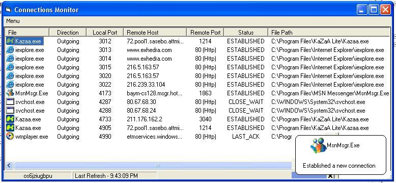



## Connections Monitor \(Firewall\)

### Description

Shows all active connections with respective programs along with their 'actual' icons, shows status and remote address (IP) that connection is been made. Comes with a neat popup of new connections made (check screen shot). i owe credit for some parts of the code to others; Ariel icon extractor and CyberAlert (thanks Guys).
 
### More Info
 
Due to user feedback i should mention that this program was done in XP professional i do not know if win9X or 2000 support these kind of commands i am working on a fix that will use API and support all windows formats. Also people that are saying it hangs on WinXP the program may hang on "bSuccess = ReadFile(hReadPipe, mybuff, Len(mybuff), bytesread, 0&)" due to the size and number of connections, patients is a virtue and it will work just make sure to disable automatic refresh at design time. thank, update will appear on planetsourcecode in a number of days.

             |
---                |---
**Submitted On**   |2003-08-31 21:50:08
**By**             |[JayStacey](https://github.com/Planet-Source-Code/PSCIndex/blob/master/ByAuthor/jaystacey.md)
**Level**          |Advanced
**User Rating**    |3.8 (15 globes from 4 users)
**Compatibility**  |VB 3\.0, VB 4\.0 \(16\-bit\), VB 4\.0 \(32\-bit\), VB 5\.0, VB 6\.0
**Category**       |[Internet/ HTML](https://github.com/Planet-Source-Code/PSCIndex/blob/master/ByCategory/internet-html__1-34.md)
**World**          |[Visual Basic](https://github.com/Planet-Source-Code/PSCIndex/blob/master/ByWorld/visual-basic.md)
**Archive File**   |[Connection1638418312003\.zip](https://github.com/Planet-Source-Code/jaystacey-connections-monitor-firewall__1-48115/archive/master.zip)

